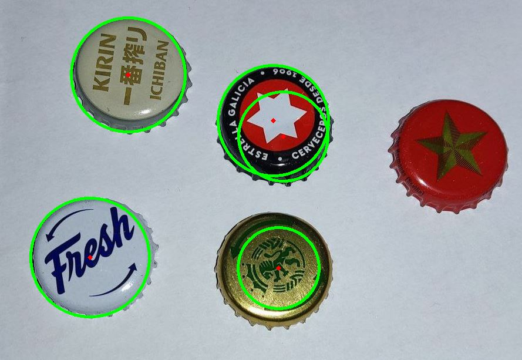

# Computer Vision Sandbox

This is a repository where I'm playing with computer vision.
 
> [!NOTE]
This code is not for production. You may notice code smells or parts that are not well-structured, but as the title suggests, it's a sandbox, so treat it as such. In this repository, I'm just having fun, not trying to develop the next Facebook :P

## Football

Inside the football example, you can see a very simple demonstration of [template matching](https://docs.opencv.org/4.x/d4/dc6/tutorial_py_template_matching.html) and [PyAutoGUI](https://pyautogui.readthedocs.io/en/latest/). I'm trying to simulate a _'cabezón'_—that's what I used to call it as a kid. The basic idea is to learn a bit about how template matching works and apply it in a simple example. The script will search a specific area of the screen, attempting to locate the ball and the left player, then use that information to move the player around the ball.

## SIFT Boardgames

In this section, you'll find a brief example of how to use [SIFT (Scale Invariant Feature Transform)](https://docs.opencv.org/4.x/da/df5/tutorial_py_sift_intro.html) for object identification. For this demonstration, I've applied SIFT to board game covers, as I found it fascinating to see how it can help identify which game I might be playing.

However, SIFT has far more advanced applications, as shown in the documentation. It can be used to recognize buildings from different angles or in various other use cases.

## HOG 

Simple use of [Hough Transform Circles](https://docs.opencv.org/3.4/d4/d70/tutorial_hough_circle.html), this case is a very basic and bad example, as it does not have any preprocessing in the image, causing to dispay false positives. In this other project about [Bottle Caps detection and intendification](https://github.com/cosminpm/bottle-caps/tree/main)  in the part of detection you can see a more advaced case of this idea, where I'm applying HOG and Blob Detection with some preprocesssing.

